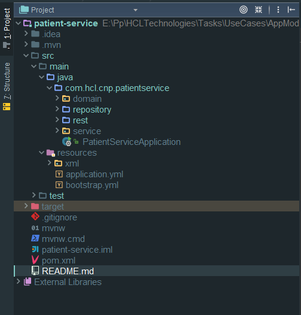
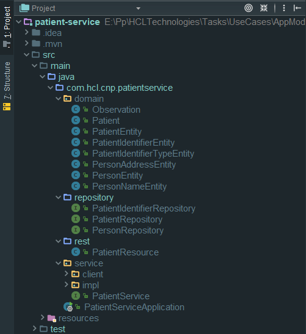
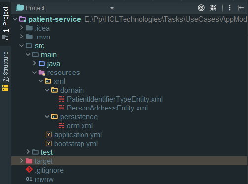

# Patient Service
This microservices is to handle the logic of the patient in the OpenMRS migration.

## Project Structure

The main structure of the app is inside of **src/main**. There we going to put all the java classes, entities, 
services, resources, etc. In the **./test** we are going to have all the test we need to make for the app.

### Java Structure

The java files are stored in **..\src\main\java\com\hcl\cnp\patientservice\\**. From this path we have the package 
**domain** when we have all the entities mapped. The repository package is for the interface Repository of each entity
we need to extend from JpaRepository. The package **rest** contain all the SpringRest implementations of the 
web service our api is going to have. The service layer is inside the **service** package, there we have implementation 
of the business logic and the clients for the communication with other microservices.

 
 ### Resource Structure
 
 In this package(resource) we have all the configuration file of the application. The way SpringBoot work is using
 **bootstrap.yml** and **application.yml** to find the configuration to start the app. Also we have a folder named **xml**, 
 here we going to save the xml files of the generated entities and for persistence configuration of JPA.  

 
 ## Communication Between Microservices
 
 Spring Cloud Open Feign is a declarative REST client that uses a Ribbon client-side load balancer in order 
 to communicate with other microservices. Other alternative is using Spring Rest Template with @LoadBalanced, 
 but Feign provides a more elegant way of defining clients. Including the next dependency:
      
      <dependency>
      <groupId>org.springframework.cloud</groupId>
      <artifactId>spring-cloud-starter-openfeign</artifactId>
      </dependency>
      
 In order to create Feign clients you have to enable your app to to that:
 
      @SpringBootApplication
      @EnableFeignClients
      public class PatientServiceApplication {
      
          .
          .
          .
      }
      
 Now, we need to define the client's interfaces.Every client's interface should be annotated with @FeignClient. 
 One field in the annotation is required - name. This name should be the same as the name of the target service 
 registered in service discovery:
 
       package com.hcl.cnp.patientservice.service.client;
       
         .
         .
         .
         
       @Service
       @FeignClient(name = "observation-service")
       public interface ObservationServiceClient {
       
           @GetMapping(path = "/patient/{patientId}")
           List<Observation> findByPatient(@PathVariable("patientId") String patientId);
       
       }
       
 Example of use the Feign client created:
 
       @Autowired
       ObservationServiceClient observationServiceClient;
         
       @GetMapping(path = "/find-one/{id}/with-observations")
       public Patient findWithObservations(@PathVariable("id") String id) {
           Patient patient = patientService.findById(id).stream().findFirst().get();
           patient.setObservations(observationServiceClient.findByPatient(id));
           return patient;
       }
       
