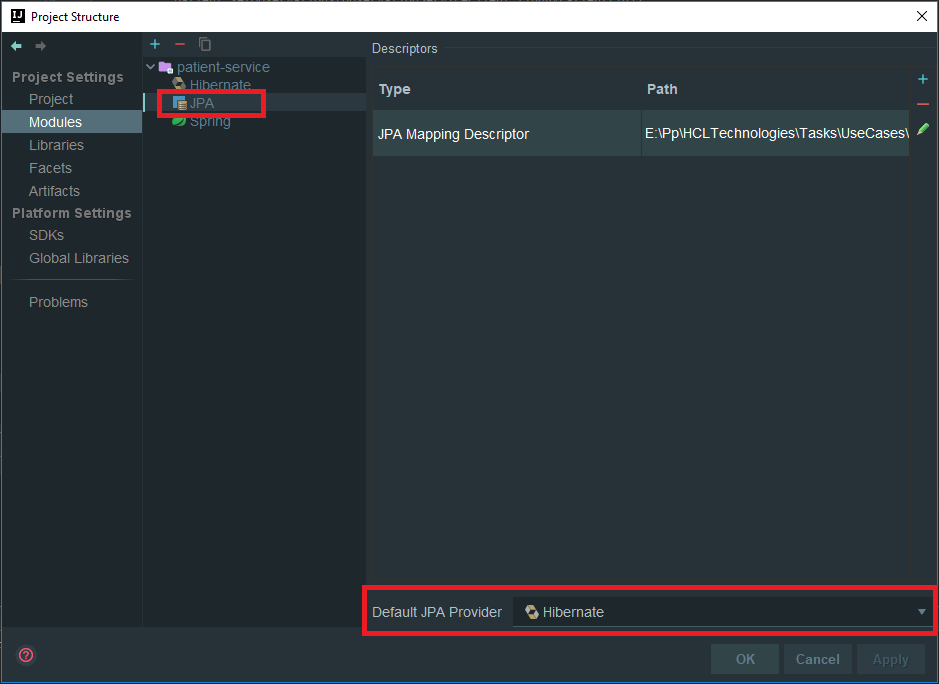

# Patient Service
This microservices is to handle the logic of the patient in the OpenMRS migration.

## Project Structure

The main structure of the app is inside of **src/main**. There we going to put all the java classes, entities, 
services, resources, etc. In the **./test** we are going to have all the test we need to make for the app.

### Java Structure

The java files are stored in **..\src\main\java\com\hcl\cnp\patientservice\\**. From this path we have the package 
**domain** when we have all the entities mapped. The repository package is for the interface Repository of each entity
we need to extend from JpaRepository. The package **rest** contain all the SpringRest implementations of the 
web service our api is going to have. The service layer is inside the **service** package, there we have implementation 
of the business logic and the clients for the communication with other microservices.

 
 ### Resource Structure
 
 In this package(resource) we have all the configuration file of the application. The way SpringBoot work is using
 **bootstrap.yml** and **application.yml** to find the configuration to start the app. Also we have a folder named **xml**, 
 here we going to save the xml files of the generated entities and for persistence configuration of JPA. The file **xml/persistence/orm.xml/orm.xml** contain configuration for JPA.

 
 ## Communication Between Microservices
 
 Spring Cloud Open Feign is a declarative REST client that uses a Ribbon client-side load balancer in order 
 to communicate with other microservices. Other alternative is using Spring Rest Template with @LoadBalanced, 
 but Feign provides a more elegant way of defining clients. Including the next dependency:
      
      <dependency>
      <groupId>org.springframework.cloud</groupId>
      <artifactId>spring-cloud-starter-openfeign</artifactId>
      </dependency>
      
 In order to create Feign clients you have to enable your app to to that:
 
      @SpringBootApplication
      @EnableFeignClients
      public class PatientServiceApplication {
      
          .
          .
          .
      }
      
 Now, we need to define the client's interfaces.Every client's interface should be annotated with @FeignClient. 
 One field in the annotation is required - name. This name should be the same as the name of the target service 
 registered in service discovery:
 
       package com.hcl.cnp.patientservice.service.client;
       
         .
         .
         .
         
       @Service
       @FeignClient(name = "observation-service")
       public interface ObservationServiceClient {
       
           @GetMapping(path = "/patient/{patientId}")
           List<Observation> findByPatient(@PathVariable("patientId") String patientId);
       
       }
       
 Example of use the Feign client created:
 
       @Autowired
       ObservationServiceClient observationServiceClient;
         
       @GetMapping(path = "/find-one/{id}/with-observations")
       public Patient findWithObservations(@PathVariable("id") String id) {
           Patient patient = patientService.findById(id).stream().findFirst().get();
           patient.setObservations(observationServiceClient.findByPatient(id));
           return patient;
       }
       
## Create entities from DB using Intellij IDEA

To create the entities from the DB, you have to first add the DB connection into the Intellij IDEA. Select which
Data source you going to use and fill the driver information(Also have to add the jdbc dependency to the pom).

Be sure to test your connection and able to see the DB and tables in the Intellij IDEA

After done that, now we have to tell Intellij IDEA that we are using the ORM Hibernate:

 1- Go to Project Structure (alt+ctrl+shift+s)  
 2- In "Project settings" select "Modules"  
 3- Press + and add the Hibernate facet in your module.
 
 
 
 Now you have setup your hibernate configuration facet you can extract your pojos.
 
  1- At your bottom left horizontal panel you will now see a tab called "Persistence" (ιf you can't find 
    Persistence tab you may show it by choosing View > Tool Windows > Persistence)  
  2- There you can right click on the JPA_DB icon named like your module  
  3- Go to "Generate Persistence Mapping"-"by database schema"  
  4- Now I guess you can find your way...  
  5- In general settings select the datasource that you want to use and now you can see all the tables in your 
    datasource object  
  6- Now you can do many things, add relationships with the + sign, change the name and type of the pojo's properties 
    etc. note: if you get an error and the "OK" is disabled its probably because the data type that intelliJ found 
    for your pojo is invalid. Just change it to the one you need and you are ready to go!
    
 

Now select the entities you want to generate the POJO. Select the package when you'r going to save
the generated entities. A suffix for the entities in case tou want and be sure the check the option
**Generate JPA Annotations(Java5)**

 